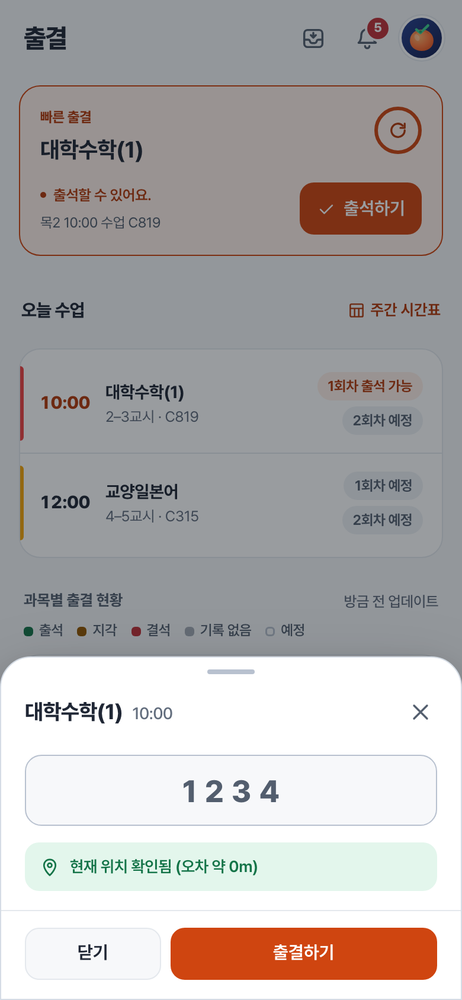
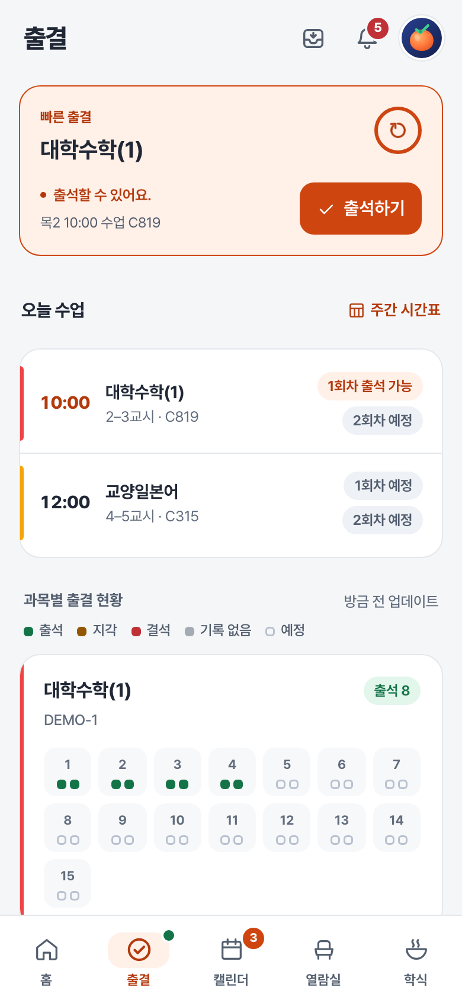
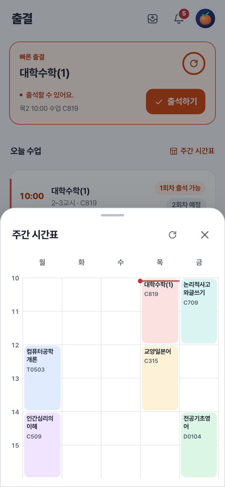

# 출결

출석번호를 입력하고, 과목별 출결 기록을 확인해요.

[홈](../../README.md) | [사용 안내](../user-guide.md) | [캘린더](calendar.md) | [열람실](seats.md) | [학식](meals.md)

## 바로 출석하기

1. 홈의 **빠른 출결**이나 출결 탭에서 **출석하기**를 눌러요.
2. 위치 권한을 허용하고 위치 확인을 기다려요.
3. 4자리 출결번호를 입력해요.
4. **출결하기**를 누르고 결과를 확인해요. 출석 처리를 확인하면 입력창이 닫혀요.

* 번호가 틀리거나 위치를 확인하지 못하면 안내를 확인한 뒤 다시 시도해 주세요.

## 출석 상태 읽기

| 표시 | 기준 | 처리 |
| --- | --- | --- |
| 출석, 지각, 결석 등| 해당 과목 출석부 공개 | 학교 출석부의 기록을 우선시하여 표시 |
| 출석, 지각, 결석 등 | 홍시에서 출석 후 학교의 성공 응답 확인 | 출석, 지각 등으로 표시 |
| 확인 불가 | 출석부 비공개 및 홍시에서 출결 없음 | - |
| 확인 중 | 출결이 열리지 않았거나 없음 등 | - |

* **확인 불가는 결석이라는 뜻이 아니에요.** 출석부 비공개 과목을 공식 앱이나 웹사이트에서 출석했다면 홍시가 그 결과를 확인하지 못할 수 있어요.
* 홍시가 별도로 보관하는 성공 기록은 당일 확인용이에요. 지난 날짜의 출결은 학교 출석부를 기준으로 봐 주세요. 학교가 출석부를 공개하지 않았다면 지난 기록도 확인할 수 없어요.

## 오늘 수업과 주간 시간표

**오늘 수업**에서 수업 시간, 강의실과 교시별 상태를 확인해요. 모바일에서는 오른쪽의 **주간 시간표**를 누르면 주간시간표를 볼 수 있어요.

설정의 **주간 시간표**에서 표시 범위를 바꿀 수 있어요.
* 기본 : 최적화 표시

| 설정 | 표시 방식 |
| --- | --- |
| 최적화 표시 | 첫 수업 전과 마지막 수업 후의 공강을 줄여서 보여줘요. |
| 전체 표시 | 앞뒤 공강을 포함한 전체 시간표를 보여줘요. |

## 과목별 출결 기록

과목 아래의 주차를 누르면 해당 날짜와 교시별 기록을 볼 수 있어요.

출석, 지각, 결석, 공결, 기록 없음, 예정은 서로 다른 상태예요. 

### 새로고침과 조회 주기가 궁금해요

출석 가능 여부를 확인하는 동안에는 10초 간격으로 다시 조회해요. 화면에 보이는 새로고침 버튼으로 바로 확인할 수도 있어요.

시간표와 과목별 출석부는 별도로 불러와요. 학교에서 내용을 바꿨다면 해당 화면을 새로고침해 주세요.

## 출결 위젯

**빠른 출결** 위젯에서 새로고침을 누르고 출석번호를 입력할 수 있어요. 최종 출석 버튼도 앱을 열지 않고 처리하며, 짧은 안내는 화면 아래에 토스트 알림으로 나타나요. 위치 권한과 유효한 로그인이 필요해요.

---

[사용 안내](../user-guide.md)
