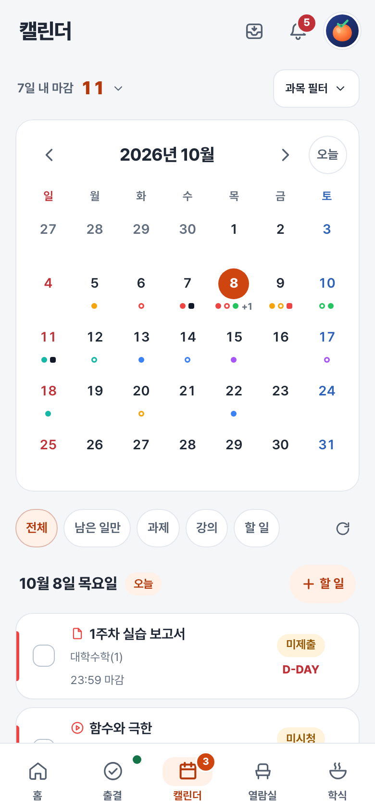
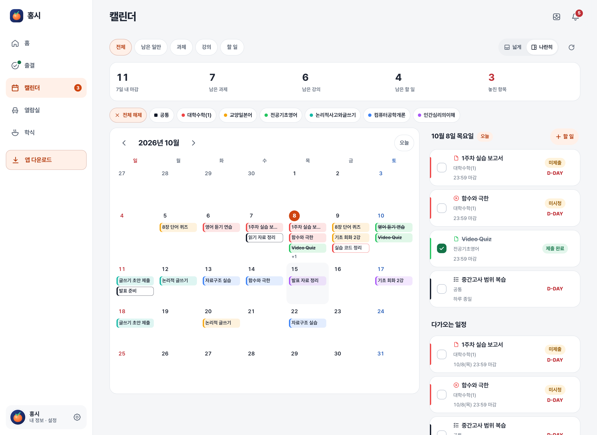
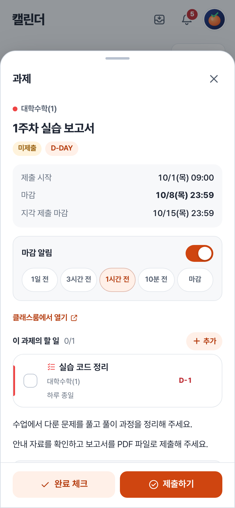

# 캘린더

과제와 온라인 강의의 마감을 확인하고, 직접 만든 할 일도 함께 관리해요.

[홈](../../README.md) | [사용 안내](../user-guide.md) | [출결](attendance.md) | [열람실](seats.md) | [학식](meals.md)

## 일정 찾아보기

캘린더에서 날짜를 누르면 그날의 일정을 확인할 수 있어요. 과목 필터로 보고 싶은 과목만 골라 볼 수 있습니다.

### 넓은 화면에서 보기

## 일정 카드 읽기

| 표시 | 의미 |
| --- | --- |
| 제목 및 과목명 | 일정의 제목 및 과목. 커스텀 할 일은 별도 태그 이용 |
| 마감 시각 | 마감 날짜와 시간 |
| 하루 종일 | 마감시각에 특정 시간을 정하지 않은 경우. 24:00으로 처리 |
| D-DAY | 마감 날짜까지 남은 일수 |
| 미제출, 제출 완료, 미시청 등 | 클래스룸에서 확인한 과제 상태 태그 |
| 체크박스와 취소선 | 홍시에서 관리하는 완료 표시 |

**완료 체크와 클래스룸 상태는 달라요.** 체크하면 취소선이 생기고 남은 일에서 빠져요. 하지만 체크만으로 과제가 제출되거나 강의 시청이 완료되지는 않아요.

처음에는 클래스룸의 완료 상태를 참고해 체크해요. 직접 바꾼 체크값이 있다면 그 값을 유지해요. 상태 배지는 계속 클래스룸의 상태를 보여줘요.

## 직접 할 일 만들기

1. **할 일** 추가 버튼을 눌러요.
2. 제목과 날짜를 정해요. 날짜는 반드시 선택해야 해요.
3. 필요하면 과목, 시간, 메모와 마감 알림을 정해요.
4. 저장하면 같은 계정으로 로그인 한 웹과 앱에서 확인할 수 있어요.

* 특정 시간이 없으면 **하루 종일**을 선택해요.
* 과제 상세 화면에서 관련 할 일을 추가할 수도 있어요.

## 과제 확인과 제출

과제를 누르면 설명, 첨부파일, 마감 시각과 제출 상태를 확인할 수 있어요.

1. **제출하기**를 눌러 파일을 선택해요.
2. 파일 개수와 크기 제한을 확인해요.
3. 제출 확인을 마친 뒤 진행 화면에서 결과를 기다려요.
4. 결과를 확인하고 제출된 파일이 맞는지 살펴봐 주세요.

이미 제출한 과제는 **제출 파일 수정**으로 바꿀 수 있어요. 마감 이후 제출하거나 수정하면 지각 제출로 기록될 수 있으니 확인 문구를 읽어 주세요.

## 항목별 마감 알림

과제, 강의 또는 할 일의 상세 화면에서 알림을 켜고 원하는 시간을 골라요. **1일 전, 3시간 전, 1시간 전, 10분 전, 마감**을 여러 개 선택할 수 있어요. **마감**은 마감 시각에 알려주는 설정이에요.

- 별도로 시간을 설정하지 않은 항목은 설정의 기본 마감 알림 시간을 따라요.
- 항목에서 직접 설정한 시간은 알림을 껐다 켜도 유지돼요.
- 완료 체크한 항목과 마감 시각이 없는 항목에는 마감 알림을 보내지 않아요.

### 00:00과 24:00 표시는 무엇이 다른가요?

설정의 **00:00 마감 표시**에서 선택할 수 있어요. `10월 3일 00:00`과 `10월 2일 24:00`은 같은 시각이에요. 표시만 바뀌고 실제 마감 시각은 달라지지 않아요.
> 제작자가 학교 클래스룸 달력에서 23:59분 과제와 다르게 00:00 과제는 다음날로 표시되는게 ~~짜증나서~~ 헷갈려서 추가한 설정이에요.

### 찾는 과제나 강의가 없어요

종류와 과목 필터, 남은 일만 표시하는 설정, 완료 체크와 마감 날짜를 확인해 주세요. 지난 학기 자료라면 설정의 **학기 표시**를 **전체 학기**로 바꿔 보세요.

마감일이 없는 과제는 설정의 **마감일 없는 과제 표시**를 켜면 **날짜 미정**에서 확인할 수 있어요.

## 마감 위젯

**다가오는 마감** 위젯은 완료 체크하지 않은 앞으로의 마감을 보여줘요. 4×2와 4×4 크기가 있고, 화면에 다 담지 못한 항목은 아래에 개수를 표시해요.

---

[사용 안내](../user-guide.md)
