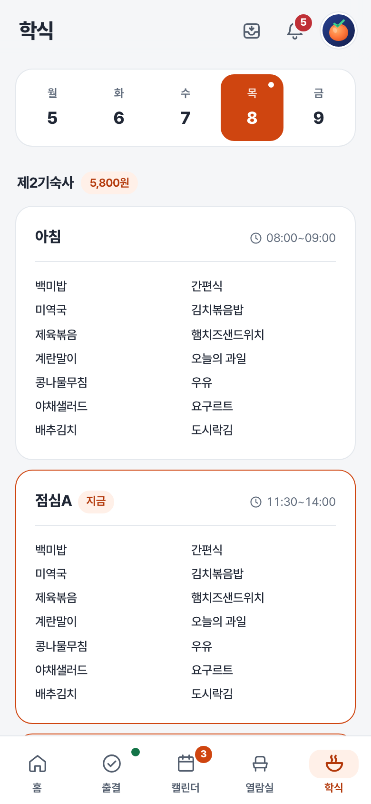

# 학식

요일별 메뉴와 가격, 식사 제공 시간을 확인해요.

[홈](../../README.md) | [사용 안내](../user-guide.md) | [출결](attendance.md) | [캘린더](calendar.md) | [열람실](seats.md)

## 메뉴 확인하기

1. 학식 탭 위쪽에서 요일을 골라요.
2. 식당별 아침, 점심, 저녁 메뉴를 확인해요.
3. 카드 위쪽에서 가격과 식사 제공 시간을 확인해요.

## 홈에 표시할 식당 고르기

프로필을 눌러 설정을 열고 **학식 기본 식당**에서 **제2기숙사** 또는 **교직원식당**을 골라요. 홈의 **오늘 학식**에 선택한 식당을 우선 표시해요.

## 메뉴가 없을 때

주말이나 공휴일에는 운영하지 않거나 메뉴가 등록되지 않을 수 있어요. 날짜를 확인하고 다른 요일도 선택해 보세요. 조회 오류가 표시된다면 잠시 뒤 새로고침해 주세요.

메뉴와 가격, 운영 시간은 학교 사정에 따라 바뀔 수 있어요. 홍시는 학교에서 제공하는 정보를 보여주므로 현장 안내도 함께 확인해 주세요.

---

[사용 안내](../user-guide.md)
