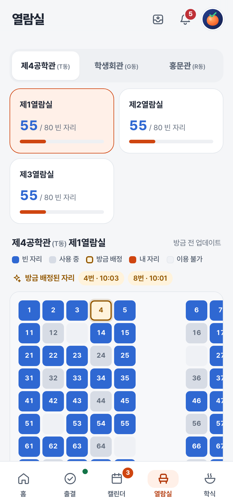
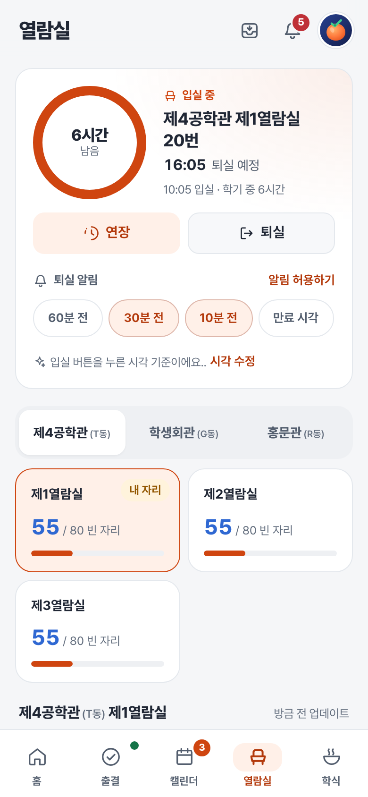

# 열람실

> 열람실 현황을 확인하고, 배정받은 좌석의 남은 시간과 종료 알림을 관리해요.

[홈](../../README.md) | [사용 안내](../user-guide.md) | [출결](attendance.md) | [캘린더](calendar.md) | [학식](meals.md)

**실제 좌석 배정은 학교 좌석배정기에서 해 주세요.** 홍시의 입실, 연장, 퇴실은 이용 기록과 알림만 관리하는 기능이에요. 실제 학교 좌석의 배정이나 반납을 대신 처리하지 않아요.

## 빈자리 찾기

1. 학생회관, 제4공학관, 홍문관 중 해당하는 건물을 골라요.
2. 열람실을 선택하고 빈자리 수를 확인해요.
3. 좌석 지도에서 위치와 사용 여부를 살펴봐요.

* 지도에서 빈자리, 사용 중인 자리와 내 자리의 표시를 확인할 수 있어요.
* **방금 배정된 자리**는 좌석 지도에서 상태 변화를 확인한 자리예요.
* 지도는 주기적으로 갱신되므로 실제 현황과 잠시 차이가 날 수 있어요.

## 내 좌석 등록하기

학교에서 좌석을 배정받은 후 진행해 주세요.

1. 지도에서 배정받은 좌석을 눌러요.
2. 좌석 이용 시간을 선택해요.
3. **이 자리로 입실**을 눌러 홍시에 기록해요.

* 배정 시각을 서버에서 찾으면 그 시각을 사용해요. 찾지 못하면 입실 버튼을 누른 시각을 기준으로 해요.
* 실제 시작 시각과 다르면 **시각 수정** 버튼으로 맞출 수 있어요.

### 남은 시간이 실제 좌석배정기와 달라요

홍시는 서버에 기록된 시작 시각 또는 사용자가 선택한 이용 시간을 기준으로 남은 시간을 계산해요. 학교의 실제 이용 종료 시각을 직접 읽어오는 것은 아니에요.

### 이용 중인데 지도에서는 빈자리로 나와요

지도 반영이 늦거나 실제 이용 상태와 홍시의 기록이 다를 수 있어요. 학교 좌석배정기에서 현재 배정 상태를 확인해 주세요. 홍시에 이용 중이라고 표시되는 것만으로 실제 좌석이 유지되지는 않아요.

## 좌석 위젯

**열람실 좌석** 위젯에서 좌석 번호와 남은 시간을 볼 수 있어요.

- **연장**은 앱을 열지 않고 홍시의 이용 기록을 연장해요.
- **퇴실**은 앱을 열고 확인창을 보여줘요.

남은 시간은 저장된 종료 시각을 기준으로 1분마다 갱신해요. 화면이 꺼져 있거나 절전 중이면 표시 갱신이 늦어질 수 있어요.

---

[사용 안내](../user-guide.md)
