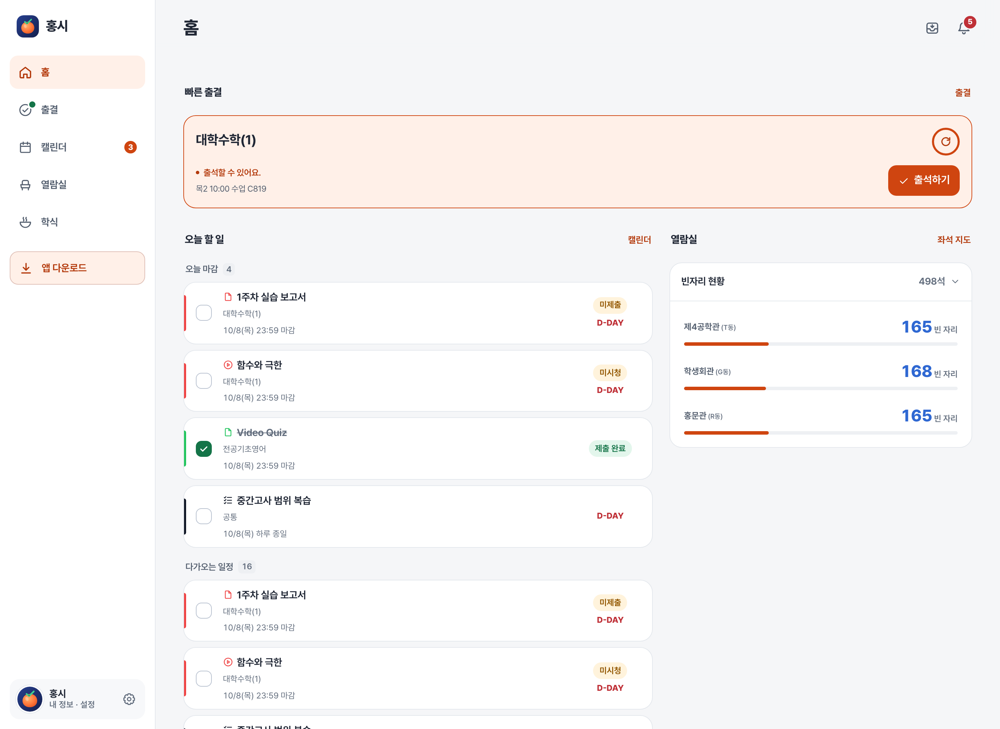
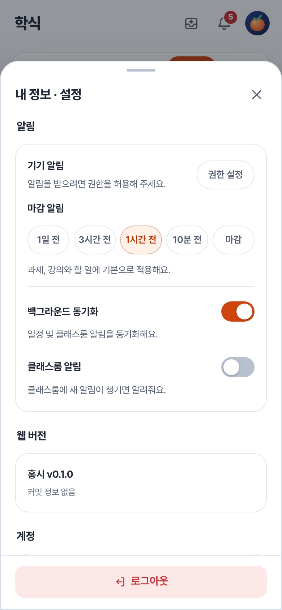

# 홍시 사용 안내

| 문서 | 내용 |
| --- | --- |
| [홈](../README.md) | 프로젝트 소개 |
| [출결](features/attendance.md) | 출석하고 시간표 보기 |
| [캘린더](features/calendar.md) | 과제와 할 일 관리하기 |
| [열람실](features/seats.md) | 빈자리와 이용 시간 확인하기 |
| [학식](features/meals.md)| 오늘 메뉴 확인하기  |

> 스크린샷은 예시 데이터를 넣어 구성했어요. 화면이 조금씩 다를 수 있어요.

## 로그인하고 홈 살펴보기

[웹에서 시작하기](https://hongsi.kyuyoung.dev/) 또는 [Android 앱 받기](https://hongsi.kyuyoung.dev/download)

> 학번과 비밀번호로 로그인해요. 학번은 자동으로 대문자 처리해요.

- **빠른 출결**에서 바로 출석할 수 있어요.
- **오늘 할 일**과 **다가오는 일정**에서 마감이 가까운 할 일을 확인해요.
- **열람실**과 **오늘 학식**에서 열람실 현황과 학식 메뉴를 확인해요.
- 알림 버튼에서 클래스룸 알림을 확인해요. 알림을 눌러 공지사항을 보거나 첨부파일을 다운받을 수 있어요.
- 프로필을 누르면 설정을 열 수 있어요.

### 로그인 정보는 어디에 보관하나요?

| 환경 | 보관 방식 |
| --- | --- |
| 앱의 자동 로그인 | 학번, 비밀번호와 재사용할 인증정보를 기기 보안 저장소에 보관해요. 앱은 학교에 직접 로그인하며 비밀번호를 홍시 서버에 보내지 않아요. |
| 웹의 로그인 상태 유지 | 학교 로그인 처리를 위해 비밀번호를 서버로 전송하지만 저장하지 않아요. 브라우저는 홍시 로그인 쿠키를 사용하고, 서버는 학교 인증정보를 암호화해 보관해요. |
| 백그라운드 동기화 | 앱이나 웹을 닫아도 조회할 수 있도록 학교 인증정보를 서버에 암호화해 보관해요. 비밀번호는 보관하지 않아요. |

* 공용 기기에서는 자동 로그인이나 로그인 상태 유지를 선택하지 말고, 사용 후 로그아웃해 주세요.

## 학생증 QR 열기

1. 앱에서 **자동 로그인**을 켜고 로그인해요.
2. 프로필을 눌러 설정을 열어요.
3. 내 정보 칸 오른쪽의 QR 아이콘을 눌러요.
4. 발급된 QR을 사용하고 창을 닫아요.

* 이 기능은 기기에 보관한 학교 로그인 정보를 사용해요.

## 필요한 알림 설정하기

프로필을 누르고 설정의 **알림**으로 내려가세요.

| 설정 | 하는 일 |
| --- | --- |
| 기기 알림 | 이 기기에서 알림을 받을 수 있는지 확인해요. |
| 백그라운드 동기화 | 홍시를 닫아도 학교 정보를 확인하고 알림을 처리할 수 있도록 연결해요. |
| 클래스룸 알림 | 동기화를 켠 상태에서 클래스룸의 새 알림을 받아요. 기본으로 꺼져 있어요. |
| 마감 알림 | 과제, 강의와 할 일에 적용할 기본 알림 시간을 골라요. 기본은 1시간 전이에요. |

* 처음 자동 로그인이나 로그인 상태 유지를 선택하면 백그라운드 동기화도 켜져요.
* 클래스룸 알림을 켤 때 권한이 없으면 권한 안내창이 나와요. 

> 항목별 알림은 [캘린더 안내](features/calendar.md#항목별-마감-알림), 좌석 종료 알림은 [열람실 안내](features/seats.md#이용-중에-할-수-있는-일)를 참고해 주세요.

### 설정을 켰는데 알림이 오지 않아요

기기 알림 권한, 백그라운드 동기화와 해당 항목의 알림 설정을 확인해 주세요. 완료 체크한 항목은 마감 알림 대상에서 빠져요. 설정 아래에 연결 오류가 있다면 안내를 확인하고 다시 적용해 주세요.

## 로그아웃과 업데이트

설정 하단의 **로그아웃**을 누르면 현재 기기의 로그인과 연결 정보를 지워요. 앱에서 보관한 비밀번호도 삭제해요. 다른 기기의 로그인은 유지돼요.

**모든 기기에서 로그아웃**은 서버에 저장된 해당 계정의 인증정보와 연결을 모두 해제해요. 할 일, 완료 체크 같은 앱 데이터를 삭제하는 기능은 아니에요.

Android에서는 앱을 새로 실행할 때 업데이트를 확인해요. 설정의 **업데이트 확인**으로 직접 확인할 수도 있어요. 설치 권한을 요청하면 안내에 따라 허용해 주세요.

## 위젯

| 위젯 | 크기 | 사용법 |
| --- | --- | --- |
| 열람실 좌석 | 2×2 | [남은 시간과 연장, 퇴실](features/seats.md#android-좌석-위젯) |
| 빠른 출결 | 4×2 | [출석번호 입력과 출결](features/attendance.md#android-위젯으로-이용하기) |
| 다가오는 마감 | 4×2, 4×4 | [남은 일정과 상세 화면](features/calendar.md#android-마감-위젯) |
| 오늘 수업 | 4×2, 4×4 | 수업 시간과 강의실을 확인해요. |
| 주간 시간표 | 4×4 | 주간 시간표를 확인해요. |

---

[홈](../README.md)
